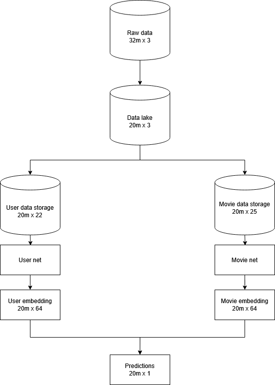

# Machine Learning Projects – Bogdan Slišković

Welcome to my machine learning project collection!  
This repository is organized into several subfolders, each containing a self-contained project with its own Jupyter notebooks and local README files.

---

## Contents

### [Movie Recommendation System](./film) (Polars, Tensorflow, PostgreSQL)

A recommendation engine built using PostgreSQL and neural collaborative filtering.  
Data is sampled from `raw.ratings`, then moved to `data_lake.ratings` for training. It is transformed and stored in:

- `data_storage.user`: contains average user ratings per genre  
- `data_storage.movie`: contains average movie ratings per genre, release year, and number of ratings  

The **primary key** in all tables is a combination of `user_id` and `movie_id`.

Features from `data_storage.user` and `data_storage.movie` are fed into separate neural networks—**User Net** and **Movie Net**—which generate 64-dimensional L2-normalized embeddings.  
Their dot product approximates **cosine similarity**, used to predict user–movie interaction.

Detailed project description [local README file](./film/README.md)

### [Logistic Regression (NumPy)](./logisticRegression_Numpy)
Custom `Logit` class implemented in pure NumPy, supporting both binary and multiclass classification. Features include L1/L2 regularization, batch gradient descent with learning rate decay, early stopping, and model rollback.  
Applied to the MNIST dataset, achieving competitive results versus Scikit-learn baselines. Also includes custom grid search and model saving with `joblib`.

### [Neural Networks (NumPy)](./neuralNetworks_Numpy) `in progress`
Manual implementation of a flexible multilayer neural network using only NumPy. Built upon the enhanced `Logit` class to support forward propagation, sigmoid and softmax-based classification, and numerical gradient computations. The project utilizes the MNIST dataset, featuring manual data preprocessing, normalization, and one-hot encoding.

### [Fashion MNIST (Keras)](./fashionMNIST_keras) `in progress`
Image classification using fully connected neural networks built with TensorFlow and Keras. Applied on the Fashion MNIST dataset with exploration of activation functions, dropout regularization, and tuning hyperparameters.  
Good foundation for future CNN implementation.

### [Titanic Modeling](./Titanik)
Comprehensive end-to-end modeling on the Titanic dataset with scikit-learn. Includes feature engineering (`deck-class`, family size), missing value imputation via KNN, model tuning with `RandomizedSearchCV`, and dimensionality reduction via PCA.  
Also explores unsupervised learning by adding `KMeans` and `DBSCAN` cluster features into the modeling pipeline.

### [Credit Risk Modeling](./Kredit)
Binary classification project using a credit dataset from OpenML. Models include Logistic Regression, SVM, and Random Forest, each with a tailored preprocessing pipeline.  
Includes analysis of overfitting, model evaluation using F1-score, and advanced interpretation tools like SHAP values and feature importances.

### [Iris Classifiers](./IRIS)
Clean, minimal exploration of the Iris dataset focusing on decision boundaries and model behavior.  
Compares Logistic Regression, SVM, and Random Forest classifiers while highlighting signs of overfitting and underfitting.

### [Automation Scripts](./automation)
Three Python scripts to streamline common development tasks:
- Launch Jupyter Notebooks from a folder (with GUI and recursive search)
- Check Git status and optionally pull updates
- Stage, commit (with timestamp), and push all changes to Git

---

## About

Each project folder contains:
- Jupyter notebooks
- A local `README.md` with full explanation
- Clean structure for reproducibility and experimentation

---

## Contact

**Bogdan Slišković**  
bogdansliskovic@gmail.com  
https://github.com/BogdanSliskovic  
https://www.linkedin.com/in/bogdan-sliskovic/
